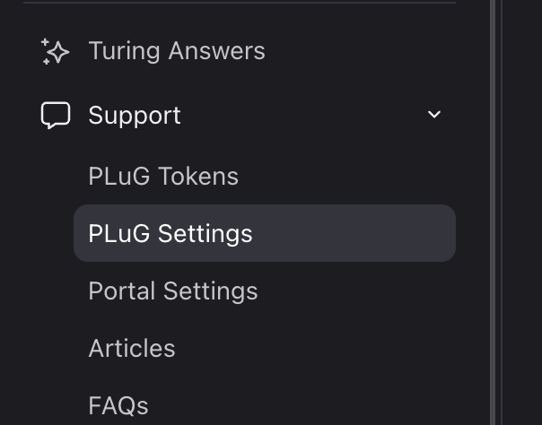
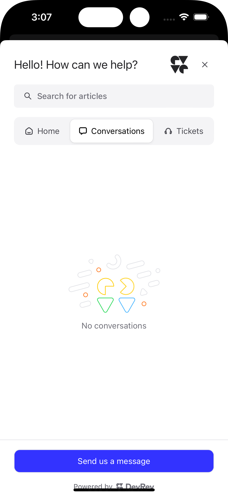

# Table of contents
- [Table of contents](#table-of-contents)
- [Requirements](#requirements)
- [Setup](#setup)
- [Swift Package Manager (Recommended)](#swift-package-manager-recommended)
- [CocoaPods](#cocoapods)
- [Setting up the DevRev SDK](#setting-up-the-devrev-sdk)
	- [Step 1: Credentials](#step-1-credentials)
	- [Step 2: Initialization](#step-2-initialization)
			- [Example](#example)
		- [UIKit apps](#uikit-apps)
		- [SwiftUI apps](#swiftui-apps)
- [Features](#features)
	- [Identification](#identification)
			- [Example](#example-1)
	- [PLuG support chat](#plug-support-chat)
		- [UIKit](#uikit)
			- [Example](#example-2)
		- [SwiftUI](#swiftui)
		- [New conversation callback](#new-conversation-callback)
			- [Example](#example-3)
	- [Analytics](#analytics)
			- [Example](#example-4)
		- [Screenshots](#screenshots)
- [Sample app](#sample-app)
- [Troubleshooting](#troubleshooting)
	- [Cannot import the SDK into my app](#cannot-import-the-sdk-into-my-app)
	- [How does the DevRev SDK handle errors?](#how-does-the-devrev-sdk-handle-errors)
	- [Why won't the support chat show?](#why-wont-the-support-chat-show)

# Requirements
- Latest stable Xcode from the [App Store](https://apps.apple.com/us/app/xcode/id497799835?mt=12), 14.0 or later.
- Swift 5.7 or later.
- Minimum deployment target iOS 15.

# Setup

# Swift Package Manager (Recommended)

You can integrate the DevRev SDK in your project as a Swift Package Manager (SPM) package.

Open your project in Xcode, go to the `Add Package` screen, add the following URL under `Enter Package URL`:
```
https://github.com/devrev/devrev-sdk-ios
```

Make sure you link the framework under the **Build Phases** screen of your app target. Find the **Link Binary With Libraries** phase and make sure that **DevRevSDK** is linked there.

Now you should be able to import and use the DevRev SDK.

# CocoaPods

The DevRev SDK can also be integrated using CocoaPods. Add the following line to your `Podfile`:
```
pod 'DevRevSDK', '~> 0.9.3'
```

Then run `pod install` in your project directory.

# Setting up the DevRev SDK
## Step 1: Credentials
1. Open the **Settings** page.

	
1. Under the **Support** section, go to **PLuG Tokens**.

	\
1. On the **PLuG Tokens** page, you will be able create your credentials under the **App Credentials**. These credentials are referred to as `appID` and `secret` in the code.
	- Create new credentials, if none exist:
	

	- Or maybe reuse any existing ones:
	

1. Next, you will have to open the **PLuG Settings** page, and copy the value under **Your Unique App ID**.
	> This value is referred to as `supportID` in the code.

	
	<br />
	

## Step 2: Initialization
Once you have the credentials, you can configure the DevRev SDK in your app. The SDK will be initialized once you have called the configuration method:

```swift
DevRev.configure(appID:secret:supportID:)
```

#### Example
```swift
DevRev.configure(appID: appID, secret: secret, supportID: supportID)
```

### UIKit apps
Configure the SDK in the `AppDelegate.application(_:didFinishLaunchingWithOptions:)` method.

### SwiftUI apps
Depending on the architecture of your app, you will need to configure the SDK at your entry point or initial view of the app.

# Features
## Identification
Certain features of the SDK **require** a user identification. Make sure that you identify the user using the `DevRev.identify(_:)` function.

The function accepts the `DevRev.Identification` structure, with the user ID (`userID`) as the only required property, all other properties are optional.

> Note: The `DevRev.identify(_:)` function is an asynchronous one, make sure that you wrap it in a `Task` when calling it from synchronous contexts.

#### Example
```swift
await DevRev.identify(Identification(userID: "foo@example.org"))
```

The identification function should be placed at the appropriate place in your app after you login your user. If you have the user information at app launch, call the function after the `DevRev.configure(appID:secret:supportID:)` method.

## PLuG support chat
### UIKit
The support chat feature can be shown as a modal screen or pushed to a navigation stack.

The following overloaded method will show the support screen:
```swift
DevRev.showSupport(from:isAnimated:)
```

1. If a `UIViewController` is passed as the `from` parameter, then the screen will be shown **modally**.
1. If a `UINavigationController` is passed as the `from` parameter, then the screen will be pushed onto the stack.

#### Example
```swift
DevRev.showSupport(from: mainViewController)
```

### SwiftUI
For SwiftUI apps we provide a specific view, you just need to use the public view property:

```swift
DevRev.supportView
```

### New conversation callback
For convenience, a callback closure has been added, that way the host app will be able to access the conversation ID.

```swift
DevRev.conversationCreatedCompletion
```

#### Example
```swift
DevRev.conversationCreatedCompletion = { conversationID in
	print("A new conversation has been created: \(conversationID).")
}
```

## Analytics
The DevRev SDK supports sending custom analytic events using a name and a string dictionary.

You can track them using the following function:
```swift
DevRev.trackEvent(name:properties:)
```

#### Example
```swift
DevRev.trackEvent(name: "open-message-screen", properties: ["id": "foo-bar-1337"])
```

### Screenshots

<br />

<br />


# Sample app
A sample app with use cases for both UIKit and SwiftUI has been provided as part of this repository.

Before you start using the sample app you will need to configure it to be used with your Apple Developer team and your DevRev credentials. For your convenience the code has been marked with compiler error directives (`#error`) at the places that need attention.

1. Add your credentials to `ContentView.swift` (SwiftUI) or `AppDelegate.swift` (UIKit).
   - After you have added the credentials, delete or comment out the compiler error lines in the respective files.
1. Configure the code signing for the sample target:
	- Open the project settings (1),
	- Select the appropriate target (2),
	- Go to the Signing & Capabilities section (3), and
	- Select your development team under Team (4).
	

# Troubleshooting
## Cannot import the SDK into my app
Check the [Setup](#setup) again and make sure that DevRevSDK is properly linked.

## How does the DevRev SDK handle errors?
The DevRev SDK outputs all errors in the console using Apple's Unified Logging System under the subsystem `ai.devrev.sdk`.

## Why won't the support chat show?
Make sure you have called the identification method (`DevRev.identify(...)`) properly.
