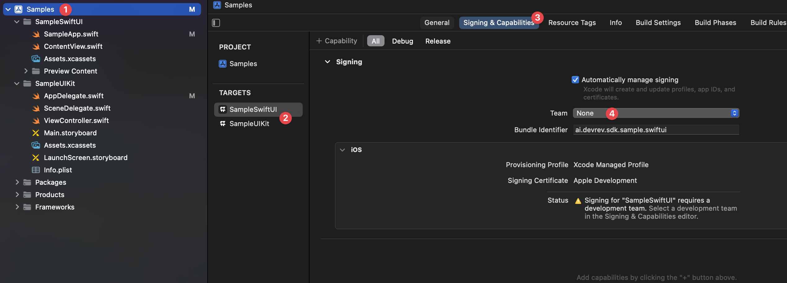

# DevRev SDK Samples

- [DevRev SDK Samples](#devrev-sdk-samples)
  - [Requirements](#requirements)
  - [Overview](#overview)
  - [Setup](#setup)

## Requirements
- Latest stable Xcode from the [App Store](https://apps.apple.com/us/app/xcode/id497799835?mt=12).

## Overview
As part of our DevRev SDK we provide a sample app in two flavors, SwiftUI and UIKit. The samples showcase the features of the DevRev SDK in a user friendly manner.

## Setup
Before you start using the sample app you will need to configure it to be used with your Apple Developer team and your DevRev credentials. For your convenience the code has been marked with compiler error directives (`#error`) at the places that need attention.

1. Open the DevRev web app at [https://app.devrev.ai](https://app.devrev.ai) and go to the **Settings** page.
2. Under **PLuG settings** copy the value under **Your unique App ID**.
3. Add your credentials to the relevant `AppDelegate.swift` of the SwiftUI or UIKit sample.
   - After you have added the credentials, delete or comment out the compiler error lines in the respective files (`AppDelegate.swift`).
4. Configure the code signing for the sample target:
	- Open the project settings (1),
	- Select the appropriate target (2),
	- Go to the Signing & Capabilities section (3), and
	- Select your development team under Team (4).
	
